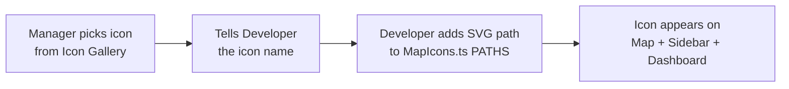

# Icon Gallery & Network Planning Icon System

## Purpose

The **Icon Gallery** (`/icon-gallery`) is a visual browser for all available icons in the OptiConnect GIS platform. It serves as a **reference catalog** for managers and developers to:

1. **Browse** all available icons from Lucide and HeroIcons libraries
2. **Search** for icons by name (e.g., "tower", "building", "signal")
3. **Copy** the import statement by clicking any icon
4. **Choose** which icon should represent a Network Planning folder on the map

---

## Available Icon Libraries

| Library | Icons | Style | Tab Color |
|---------|-------|-------|-----------|
| **Lucide** | ~1500+ | Outline/Stroke | Indigo |
| **HeroIcons Outline** | ~324 | Outline/Stroke | Emerald |
| **HeroIcons Solid** | ~324 | Filled/Solid | Amber |

> [!NOTE]
> These are the only two icon libraries installed in the project. No additional libraries are needed — between Lucide and HeroIcons, you have ~2100+ icons covering virtually every use case.

---

## How Icons Work in Network Planning

### The Icon Pipeline



### Step-by-Step Workflow

#### 1. Manager Browses Icon Gallery
- Go to `/icon-gallery`
- Use the **search bar** to find related icons (e.g., search "tower" for cell towers)
- Click the icon to **copy its import** (for reference)
- **Note down the icon name** (e.g., `TowerControl` from Lucide)

#### 2. Manager Tells Developer the Icon Name
- Provide the **icon name** and the **folder name** it should be assigned to
- Example: _"Use the `TowerControl` icon from Lucide for the 'Node' folder"_

#### 3. Developer Adds the Icon to MapIcons.ts
The developer needs to:

1. **Open** `frontend/src/features/network-planning/components/NetworkMap/MapIcons.ts`
2. **Find the SVG path** for the chosen icon (from the library source or by inspecting the rendered SVG)
3. **Add an entry** to the `PATHS` object:
   ```typescript
   "FOLDER-KEY": {
     path: "M12 2L2 22h20L12 2z",   // SVG path data
     color: [255, 107, 107],          // RGB color for the map marker
   },
   ```
4. **Add a mapping** in `getFolderIconKey()` function so the folder name resolves to this key
5. **Update the database** `network_folders.default_icon` to match the new key

#### 4. Where the Icon Appears

Once added, the icon automatically shows in:

| Location | Component | How It Resolves |
|----------|-----------|-----------------|
| **Map Markers** | `NetworkLayerOverlay.tsx` | `getIcon()` → folder_id → folderIconMap → ICON_DEFS |
| **Sidebar Catalog** | `NetworkCatalog.tsx` | `RenderMapIcon` component |
| **Active Layers** | `ActiveLayersLegend.tsx` | `getFolderIconKey()` from folder name |
| **Import Modal** | `ImportFileModal.tsx` | `useFileImport` hook reads `folder.default_icon` |
| **Dashboard KPIs** | `Dashboard.tsx` | `RenderMapIcon` component |
| **File List** | `FileList.tsx` | File's `icon_type` field |

---

## Key Files Reference

| File | Purpose |
|------|---------|
| [MapIcons.ts](file:///c:/Optimal_Telemedia_Main/OptiConnect_GIS/frontend/src/features/network-planning/components/NetworkMap/MapIcons.ts) | Master icon definitions (`PATHS`, `ICON_DEFS`, `getFolderIconKey`) |
| [NetworkLayerOverlay.tsx](file:///c:/Optimal_Telemedia_Main/OptiConnect_GIS/frontend/src/features/network-planning/components/NetworkMap/NetworkLayerOverlay.tsx) | Map tile icon resolution (3-priority system) |
| [RenderMapIcon.tsx](file:///c:/Optimal_Telemedia_Main/OptiConnect_GIS/frontend/src/components/ui/RenderMapIcon.tsx) | Reusable SVG icon renderer component |
| [useFileImport.ts](file:///c:/Optimal_Telemedia_Main/OptiConnect_GIS/frontend/src/features/network-planning/hooks/useFileImport.ts) | Auto-selects icon based on folder name during import |
| [IconGallery.tsx](file:///c:/Optimal_Telemedia_Main/OptiConnect_GIS/frontend/src/pages/IconGallery.tsx) | The Icon Gallery page for browsing |

---

## Icon Resolution Priority (Map)

When rendering icons on the map, the system uses a **3-priority fallback**:

1. **Folder ID Map** — `folder_id` → `folderIconMap` (from catalog API)
2. **Folder Name** — `folder_name` → `getFolderIconKey()` (keyword matching)
3. **Feature Type** — `icon_type` → `getIconKey()` (file-level fallback)

---

## Database Column

The `network_folders` table has a `default_icon` column that stores the icon key (e.g., `"NODE"`, `"POP"`, `"AIRTEL"`). This is the **source of truth** for which icon a folder uses.

To update a folder's icon:
```sql
UPDATE network_folders SET default_icon = 'NEW-ICON-KEY' WHERE name = 'Folder Name';
```

---

## Currently Assigned System Folder Icons

| Folder | Icon Key | Description |
|--------|----------|-------------|
| POP | `POP` | Point of Presence |
| Sub POP | `SUB-POP` | Sub Point of Presence |
| Node | `NODE` | Network Node (three-circle triangle) |
| Bandwidth BTS | `BANDWIDTH-DROP-BTS` | Bandwidth Drop BTS |
| NNI | `NNI` | Network-to-Network Interface |
| Data Center | `DATACENTER` | Data Center facility |
| Office Location | `OFFICE-LOCATIONS` | Office locations |
| Airtel | `AIRTEL` | Airtel ISP |
| Jio | `JIO` | Jio ISP |
| Tata | `TATA` | Tata ISP |
| BSNL | `BSNL` | BSNL ISP |
| Vodaphone | `VODAFONE` | Vodafone ISP |
| Optimal | `OPTIMAL` | Optimal Telemedia |
| PGCIL | `PGCIL` | Power Grid Corp |
| Railtail | `RAILTAIL` | Rail infrastructure |
| RCOM | `RCOM` | Reliance Communications |
| Sify | `SIFY` | Sify Technologies |
| TTSL | `TTSL` | Tata Teleservices |
| Indus (states) | `INDUS` | Indus Towers |
| Elevor (states) | `ELEVOR` | Elevor Towers |
| Ascend (states) | `ASCEND` | Ascend Telecom |
