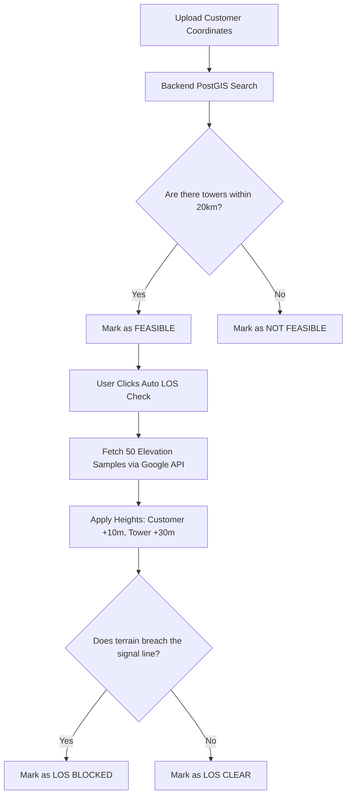

# OptiConnect GIS: Auto Feasibility & Line-of-Sight Logic

This document outlines the exact methodology the OptiConnect GIS system uses to determine if a prospective customer location is **Feasible**, and how it calculates whether the **Line-of-Sight (LOS)** is Clear or Blocked. 

You can share this document with management or network engineers to explain the system's decision-making process.

---

## Phase 1: Distance Feasibility (Backend)

When a bulk file (Excel/KML) is uploaded, the system first determines if a customer is theoretically serviceable based purely on geographic distance.

### The Logic
1. **Spatial Radius Search**: The backend uses advanced PostGIS spatial queries (`ST_DWithin`) to draw a perfect circle around the customer's exact latitude and longitude. The radius of this circle is the user-defined **Maximum Distance** (e.g., 20km).
2. **Infrastructure Identification**: It scans the database to find **all** active infrastructure (Towers, POPs) that fall inside this circle.
3. **The Decision**:
   - If **1 or more** towers are found inside the radius, the customer is marked as `Feasible`.
   - If **0** towers are found inside the radius, the customer is marked as `Not Feasible`.

> [!NOTE]
> All towers found within the radius are returned to the frontend as "Alternatives", allowing the user to seamlessly switch between different towers if the closest one is unsuitable.

---

## Phase 2: Automated Line-of-Sight (Frontend)

Even if a customer is close enough to a tower (Feasible), hills, mountains, or valleys might block the wireless signal. The **Auto LOS Check** evaluates the terrain to ensure a clear path exists.

### The Logic
1. **Elevation Sampling**: The system queries the Google Maps Elevation API to extract exactly **50 terrain elevation points** spread evenly along the straight-line path between the Customer and the selected Tower.
2. **Antenna Height Offsets**: To simulate real-world hardware deployments, the system artificially raises the start and end points of the path above the raw terrain:
   - **Customer Antenna Height**: 10 Meters
   - **Tower Antenna Height**: 30 Meters
3. **Linear Interpolation**: The system draws a mathematical straight line connecting the 10m-high customer antenna to the 30m-high tower antenna.
4. **Collision Detection**: The system loops through all 50 terrain samples along the path. 
   - If the natural terrain elevation at *any* point rises higher than the mathematical straight line, the signal crashes into the terrain.
5. **The Decision**:
   - If the signal line clears all terrain samples, it is flagged as **`LOS Clear`**.
   - If a terrain sample pierces the signal line, it is flagged as **`LOS Blocked`**, and the exact percentage distance where the blockage occurred is recorded.

> [!IMPORTANT]
> The current algorithm strictly evaluates raw terrain (earth/ground elevation). It does not factor in structural obstructions like tall buildings, dense forests, or atmospheric interference.

---

## Technical Flow Diagram

## Summary for Management

* **"Feasible"** strictly means: *"There is at least one piece of network infrastructure within our maximum distance limit."*
* **"LOS Clear"** strictly means: *"When assuming a 10m antenna at the customer and a 30m antenna at the tower, the wireless signal will not hit the ground or hills between them."*
