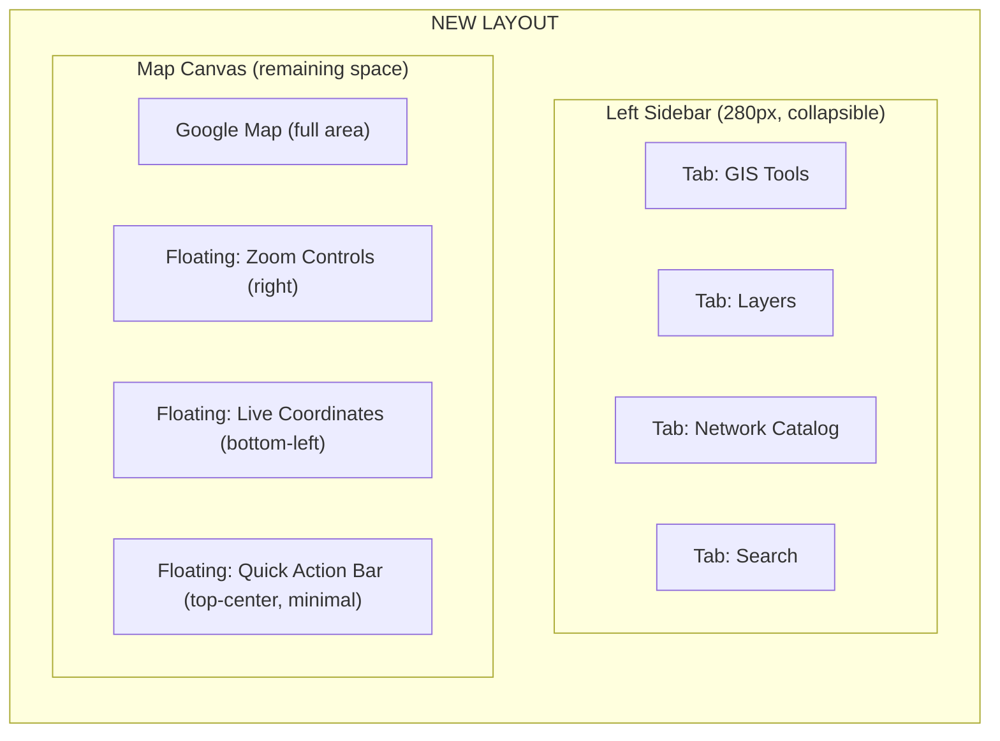

# 🗺️ Map Page Redesign: Unified Sidebar Architecture

## The Problem

Currently, the map page has **multiple overlapping panels** that fight for screen space:

| Component | Current Position | Width | Problem |
|:---|:---|:---|:---|
| **MapToolbar** | Top-center floating | ~full width | Contains GIS Tools, Layers, Search, Controls — all in one bar |
| **GIS Tool Panel** (ToolRenderer) | Floats on map (left side) | ~350px | Overlaps map when open |
| **Network Data Catalog** | Right-side full-height panel | 320px | Covers right side of map |
| **ViewOnMapDetails** | Left-side panel | ~350px | Overlaps map when open |
| **LiveCoordinates** | Bottom-left floating | auto | Fine — small footprint |

> **When GIS Toolbox + Network Catalog are both open → map is fully covered.** This is the core UX problem.

---

## The Solution: Sidebar + Floating Controls



### Architecture: What Goes Where

#### 🟦 LEFT SIDEBAR (Collapsible, 280-300px)
A single sidebar with **icon tabs** on a narrow rail (40px) + expanding content panel (240px):

| Tab Icon | Tab Name | Content (from existing components) |
|:---|:---|:---|
| 🛠️ | **GIS Tools** | Tool selection grid + active tool settings (from `GISToolsDropdown` + `ToolRenderer`) |
| 📑 | **Layers** | Layer toggles, color modes, user filter (from `LayersDropdown`) |
| 🌐 | **Network** | Full Network Data Catalog tree (from `NetworkDataCatalog`) |
| 🔍 | **Search** | Global Search with results list (from `GlobalSearch`) |

**Key Behaviors:**
- Click a tab → sidebar **slides open** (280px) showing that tab's content
- Click the **same tab again** → sidebar **collapses** back to just the icon rail (40px)
- Only **one tab is active** at a time — prevents the overlap problem entirely
- Map canvas **always** has at least `calc(100% - 280px)` visible space
- Sidebar can be **fully collapsed** to just the 40px icon rail for maximum map space

#### 🟩 FLOATING ON MAP (Keep as-is, minimal footprint)

| Element | Position | Current Component | Change Needed |
|:---|:---|:---|:---|
| **Zoom +/- & Compass** | Right-center | `CustomMapControls` | ✅ No change |
| **Live Coordinates** | Bottom-left | `LiveCoordinates` | ✅ No change |
| **Map Type Selector** | Part of MapControls | `MapControlsPanel` | Move to sidebar Settings or keep floating |
| **Fullscreen / Location** | Top-right or right-center | `MapControlsPanel` | ✅ Keep floating |

#### 🟨 TOP BAR (Drastically simplified)
The current full-width `MapToolbar` gets **eliminated**. What remains is an optional minimal floating bar:
- Just a **compact search pill** (for quick access without opening sidebar)
- Or nothing at all — search moves fully into the sidebar

---

## Visual Comparison

### BEFORE (Current)
```
┌─────────────────────────────────────────────────┐
│  [GIS▾] [Layers▾] [Network] [Labels] [Search▾] [⚙ 📍 🔄]  │  ← Full-width toolbar
├─────────────────────────────────────────────────┤
│                                          │ Network │
│  ┌─GIS Tool──┐                           │ Catalog │
│  │ Distance   │        MAP               │ (320px) │
│  │ Measure    │                           │         │
│  │ Settings   │                           │         │
│  └───────────┘                           │         │
│                                          │         │
│  [LAT: 21.4° | LNG: 69.7° | ZOOM: 6]   │         │
└─────────────────────────────────────────────────┘
        ↑ GIS panel covers left       Right panel covers right ↑
                    🔴 MAP IS BARELY VISIBLE
```

### AFTER (Proposed)
```
┌──┬───────────────────────────────────────────────┐
│🛠│                                               │
│──│                                          [+]  │
│📑│                                          [-]  │
│──│                                          [◎]  │
│🌐│               FULL MAP CANVAS                 │
│──│             (always visible)                   │
│🔍│                                               │
│  │                                               │
│  │  [LAT: 21.4° | LNG: 69.7° | ZOOM: 6]        │
└──┴───────────────────────────────────────────────┘
 40px                                          
 rail    ← Click an icon to expand to 280px →
```

### AFTER (With sidebar expanded)
```
┌──┬──────────┬────────────────────────────────────┐
│🛠│ GIS TOOLS│                                    │
│──│──────────│                               [+]  │
│📑│ Distance │                               [-]  │
│──│ Polygon  │         FULL MAP CANVAS       [◎]  │
│🌐│ Circle   │        (still has 70%+)            │
│──│ Elevation│                                    │
│🔍│ Sector   │                                    │
│  │          │                                    │
│  │ [Active] │  [LAT: 21.4° | LNG: 69.7°]        │
└──┴──────────┴────────────────────────────────────┘
 40px  240px              remaining space
```

---

## Implementation Plan

### Phase 1: Build the Sidebar Shell
Create a new `MapSidebar` component with:
- Icon rail (40px, always visible)
- Content panel (240px, slides in/out)
- Tab state management
- Smooth CSS transition for open/close

**Files to create:**
- `features/map/components/MapSidebar/MapSidebar.tsx` — Main sidebar shell
- `features/map/components/MapSidebar/SidebarTab.tsx` — Individual tab button
- `features/map/components/MapSidebar/MapSidebar.css` — Sidebar styles (vanilla CSS)

### Phase 2: Migrate Content Into Tabs
Move existing components into sidebar tabs:
1. **GIS Tools tab** — Extract from `GISToolsDropdown` + integrate `ToolRenderer` inline
2. **Layers tab** — Extract from `LayersDropdown`
3. **Network tab** — Move `NetworkDataCatalog` content inside sidebar (it's already a side panel)
4. **Search tab** — Adapt `GlobalSearch` for vertical layout

### Phase 3: Remove the Top Toolbar
- Delete or simplify `MapToolbar.tsx` 
- Keep only floating map controls (zoom, location, fullscreen)
- `MapControlsPanel` stays as floating right-side buttons

### Phase 4: Polish
- Add keyboard shortcuts (1-4 for tabs, Esc to collapse)
- Add resize handle to let user adjust sidebar width
- Ensure GIS tool settings render inside the sidebar instead of as a floating overlay

---

## Key Design Decisions

### Why Sidebar > Current Approach?
1. **Predictable space** — Map always knows how much space it has
2. **No overlap** — Only one panel visible at a time
3. **Familiar UX** — Google Earth, QGIS, ArcGIS all use left sidebar
4. **Mobile-ready** — Sidebar can become a bottom sheet on mobile

### Why NOT a Right Sidebar?
- Network Catalog is currently on the right → moving it left consolidates everything
- Right side is reserved for zoom controls and Google Maps attribution
- Left sidebar is the industry standard for GIS applications

### What About the Active Tool Panel?
Currently `ToolRenderer` renders tool-specific UIs (distance settings, polygon options, etc.) as floating panels. In the new design:
- Tool settings render **inside the GIS Tools tab** below the tool grid
- When a tool is active, the sidebar auto-opens to the GIS Tools tab
- The tool's output (measurement result, elevation data) can still float on the map as a small tooltip

---

## Risk Assessment

| Risk | Mitigation |
|:---|:---|
| Large refactor touching many files | Phase it — sidebar shell first, then migrate one tab at a time |
| Breaking GIS tool interactions | Tool drawing logic stays on map canvas — only the settings UI moves |
| Network Catalog has complex state | Its internal state stays the same — just the container changes |
| GlobalSearch has autocomplete popups | Popups render inside sidebar panel — actually easier than floating |

---

## Summary

> [!IMPORTANT]
> The core idea is: **one sidebar to rule them all**. Instead of 4 separate floating/docked panels competing for map space, you get a single, predictable, collapsible sidebar. The map stays maximally visible at all times.

**Estimated effort:** 3-4 focused sessions
**Files impacted:** ~8-10 files (mostly moving, not rewriting)
**Risk level:** Medium (phased approach reduces risk)
